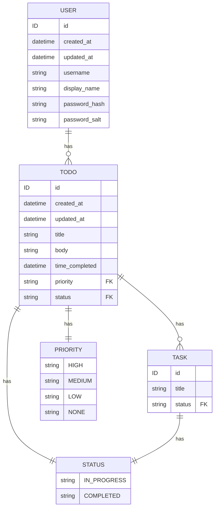

# Simple TODO server written with ent-go

## Context:

- `ent/schema` go models are transformed into graphql types + go resolvers: `ent-schema.graphql`, `ent/resolvers/ent-schema.go`
- `typedef.graphql` queries/mutations are transformed into go resolver: `ent/resolvers/typedef.go`

## Development flow:

0. `just migrate-run`
1. `just regenerate`
   - Needed when changing schema files
2. `just run`
   - Spins up graphql server

## Notes/Pre-requisites:
`ent-go` is extremely not stable

Install the following for grpc
- `brew install protobuf`
- `go install google.golang.org/protobuf/cmd/protoc-gen-go@v1.28`
- `go install google.golang.org/grpc/cmd/protoc-gen-go-grpc@v1.2`
- `go get entgo.io/contrib/entproto/cmd/protoc-gen-entgrpc`

Need to use the following packages
- `go get -u entgo.io/contrib@master`
- `go get -u entgo.io/ent@master`

## Arch

## Tasks
- [x] Setup migrations
- [x] Setup Relay Node Interface
- [x] Setup relations
- [x] Setup more tables
- [x] Setup more operations
- [ ] Setup remote schemas with gRPC
- [ ] Setup permissions
- [ ] Setup multi-tenancy
- [ ] Setup relay UI

## Stretch
- [ ] Schema diffs
- [ ] CI/CD pipeline
- [ ] Switch to postgres
- [ ] Mono-repo support