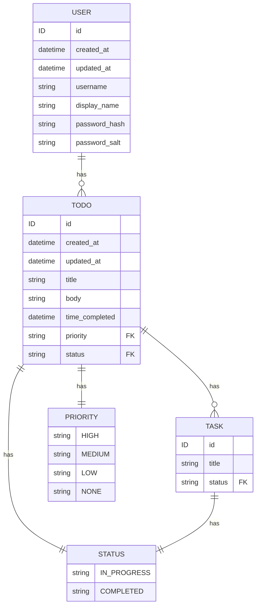

# Simple TODO server written with ent-go

## Context:

- `ent/schema` go models are transformed into graphql types + go resolvers: `ent-schema.graphql`, `ent/resolvers/ent-schema.go`
- `typedef.graphql` queries/mutations are transformed into go resolver: `ent/resolvers/typedef.go`

## Development flow:

0. `just migrate-run`
1. `just regenerate`
   - Needed when changing schema files
2. `just run`
   - Spins up graphql server

## Arch

## Tasks
- [x] Setup migrations
- [x] Setup Relay Node Interface
- [x] Setup relations
- [x] Setup more tables + operations
- [ ] Setup permissions
- [ ] Setup multi-tenancy